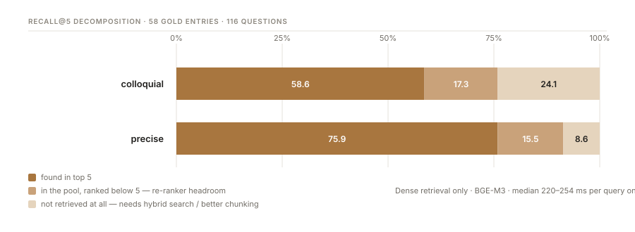

# MVP baseline: what dense retrieval alone achieves

*Day 1 · 15 DGUV documents · 1,872 chunks · 58 gold entries · 116 questions*

## How the gold set was built

Retrieval cannot be measured without knowing the correct passage for every test
question. Establishing that by hand over ~950 pages was not affordable, so the task was
reversed: a known passage is given to a model, which writes the question it answers.
The correct location is then known by construction.

Each passage yields **two** questions — one colloquial, one naming the document
designation and section — plus a verbatim quote that must occur in the passage, which
is checked automatically. The gold label is anchored to *document + page + quote*, never
to a chunk id, so the same gold set survives a change to the chunking strategy.

## Baseline

| Question form | Recall@5 | Recall@20 | MRR | nDCG@5 | Median latency |
|---|---:|---:|---:|---:|---:|
| colloquial | 0.586 | 0.759 | 0.442 | 0.467 | 220 ms |
| precise | 0.759 | 0.914 | 0.572 | 0.602 | 254 ms |

## Three findings

**The gold set discriminates.** Recall@5 sits between 0.59 and 0.76. Had it been near
1.0, the generated questions would simply be echoing the wording of their source
passage, and no later improvement could have been measured. This was the main risk in
using synthetic questions, and it did not materialise.

**Spoken language is the hard case — not exact designations.** The working hypothesis
was that a semantic retriever would struggle with precise references such as *DGUV
Information 203-071*. The opposite holds: precise questions score **17 points higher**.
BGE-M3 is not purely conceptual — technical terms occurring literally in a passage carry
the match. Colloquial questions avoid exactly those terms, and German technical compounds
have few everyday neighbours in embedding space. *"How often do I need this checked?"*
sits far from *"Wiederkehrende Prüfung ortsveränderlicher elektrischer Betriebsmittel"*.

**Two different problems, two different remedies.**

The middle band is what a re-ranker can win: the correct passage is already in the
candidate pool, merely ranked too low. It is worth ~16 points for both question forms.
The right-hand band is beyond a re-ranker's reach — a passage never retrieved cannot be
promoted. Closing it requires lexical matching or better chunking, and it is nearly
three times larger for colloquial questions.

## Prediction for the next iteration

Stated before the measurement, so it can be wrong:

1. **BM25 + rank fusion** helps *precise* questions more than colloquial ones, because
   exact designations and paragraph numbers are lexical signals a dense vector blurs.
2. **The cross-encoder re-ranker** helps both roughly equally, and moves MRR more than
   Recall@20 — by construction it reorders a pool, it does not enlarge it.

## Limitations

- **n = 58 per question form.** The confidence interval on a single proportion is roughly
  ±0.13. Improvements below ~10 points should not be claimed as established. Paired
  comparisons across configurations on the same gold set are more sensitive than that.
- **Per-document recall rests on 3–5 questions each.** One question shifts a value by
  20–25 points. Useful for spotting where to look, not as evidence.
- **Questions are model-generated.** The colloquial variant is additionally instructed to
  paraphrase and avoid rare technical terms, while the precise variant is not — so part
  of the 17-point gap is built into the generation design. A small set of questions from
  a practising electrician serves as the control sample.
- **17 of 75 candidate passages were rejected** during gold set generation, mostly tables
  and passages carrying control characters from PDF extraction.

## Operational note

Dense retrieval runs at ~250 ms per query on CPU. Even with a cross-encoder over 20
candidates, a full evaluation run stays in the range of minutes — so measurement and
deployment can both stay on CPU, and the reported latency reflects what a user will
actually experience.
