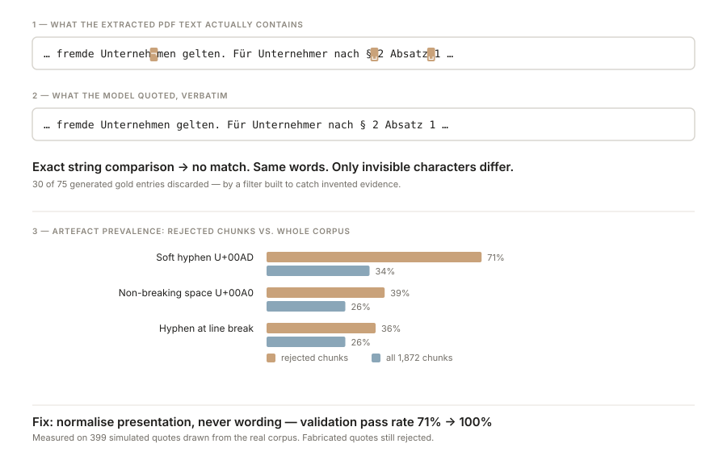

# Finding: a hallucination filter surfaced a text-extraction defect

*Day 1 · MVP baseline · corpus of 15 DGUV documents, 1,872 chunks*

## Symptom

The gold set is built by reverse question generation: a passage is given to a model,
which writes two questions and a verbatim quote proving the answer is in that passage.
The quote is then checked against the chunk. If it is not found literally, the entry is
discarded as unsupported.

On the first run, **30 of 75 entries were discarded — 40 %**, all with the same reason:
*snippet not found verbatim in the chunk*.

## First hypothesis, and why it was wrong

The obvious reading is that the model invented its evidence. It had not. Comparing the
rejected chunks against the corpus as a whole showed a different pattern:

| Artefact | In rejected chunks | Across all chunks |
|---|---:|---:|
| Soft hyphen (U+00AD) | 71 % | 34 % |
| Non-breaking space (U+00A0) | 39 % | 26 % |
| Hyphen before a line break | 36 % | 26 % |

The extracted PDF text carries the typesetting of the original document. Justified text
in German regulations breaks words across lines, and the PDF records that break as a
soft hyphen inside the word: `Unterneh<U+00AD>\nmen`. Paragraph references are held
together with non-breaking spaces: `§<U+00A0>2 Absatz<U+00A0>1`.

A reader — and a language model — sees *Unternehmen* and *§ 2 Absatz 1*, and quotes them
that way. A character-by-character comparison against the raw string does not.

**The filter was discarding correct entries, not incorrect ones.**

## Fix

Text normalisation now neutralises presentation before comparing: soft hyphens removed,
words rejoined across a hyphenated line break, non-breaking spaces replaced, dash and
quote variants unified, whitespace collapsed. **Wording is never altered**, so a
genuinely different sentence still fails to match.

Validated on 399 quotations sampled from the real corpus and cleaned the way a model
cleans them: **acceptance rose from 71 % to 100 %**, while fabricated quotations
continued to be rejected. The 71 % matches the 45-of-75 observed in the failing run.

## Why this mattered more than a bug fix

**The sample was corrupted, not merely smaller.** Rejections were not evenly spread:
one document retained 1 of its 5 entries, another 2 of 5. The stratified sample — chosen
specifically so a 132-page document could not dominate the evaluation — had silently
collapsed. Nothing in the output looked like an error.

**The defect is in the index, not only in the check.** The same artefacts sit in the
text that was embedded. The embedding model sees `Unterneh<U+00AD>men` as a word split
in two, so a query about *Unternehmen* matches it less well. Roughly a third of all
1,872 chunks are affected. This depresses retrieval quality invisibly — there is no
error message for a slightly worse vector.

**Consequence for the next iteration:** text cleaning moves from an unused module into
the pipeline, with the correct rules (soft hyphens, de-hyphenation, non-breaking spaces)
rather than dictionary-based word merging, which would corrupt technical German. Its
effect becomes one more measurable row in the ablation table.

## Method note

`normalise()` is used in two places: validating generated gold entries, and deciding
whether a retrieved chunk counts as a hit during evaluation. Defining the rule once
meant one correction repaired both.

The relaxation is deliberately limited to presentation. *"alle zwölf Monate"* and
*"alle sechs Monate"* still compare as different; the unit tests in `test_metrics.py`
assert exactly that.

## The point worth making

> I built a validation step to catch hallucinated evidence. It caught none — but it
> exposed a text-extraction defect affecting a third of the corpus, which would
> otherwise have degraded retrieval silently. The filter paid for itself before it ever
> did the job it was written for.
